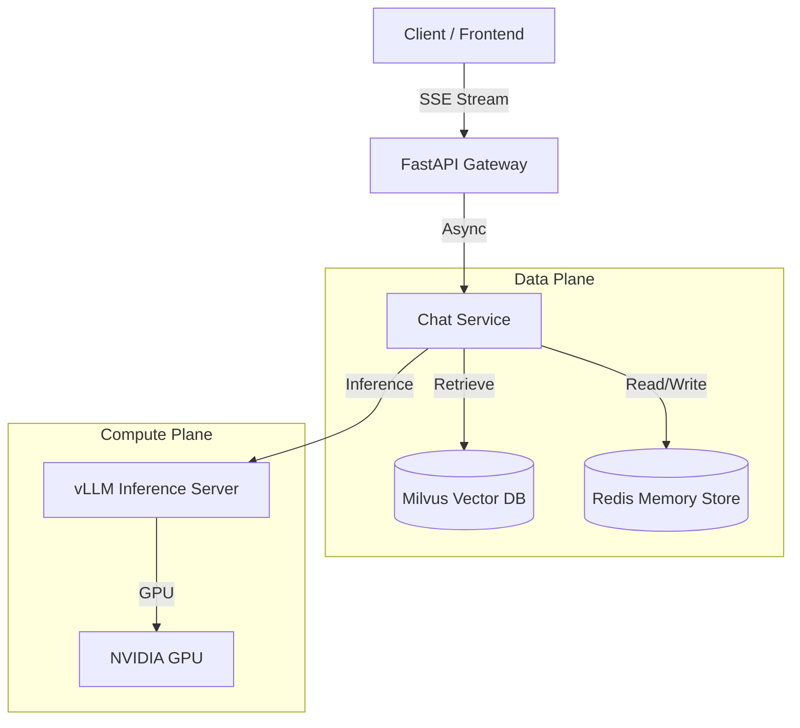

# Enterprise AI Brain (RAG Infrastructure)

[ **English** ] | [ [中文](./README_zh.md) ]

> A production-grade AI Knowledge Base backend featuring **Dual-Layer RAG**, **Async Inference**, and **Persistent Memory**. Built for scale with high-performance engineering standards.

  

## 🏗 System Architecture

This project implements a scalable **Retrieval-Augmented Generation (RAG)** pipeline designed to solve common enterprise challenges: Data Hallucination, Context Window Limits, and Stateless Interactions.



## 🚀 Key Features

* **High-Performance Inference:** Decoupled inference engine using **vLLM** (PagedAttention) for 10x throughput compared to naive Transformers.
* **Enterprise RAG:**
* **Milvus** for billion-scale vector storage.
* **Hybrid Search** (Semantic + Keyword) support.
* **LlamaIndex** orchestration for advanced chunking strategies.


* **Contextual Memory:** **Redis-backed session management** allows the AI to remember user context across multi-turn conversations (Sliding Window strategy).
* **Streaming First:** Full **Server-Sent Events (SSE)** support for <500ms Time-To-First-Token (TTFT).
* **Production Ready:**
* **Requirements.txt** for dependency management.
* **Dockerized** for consistent deployment.
* **Clean Architecture** (Controller-Service-Repository pattern).


## 🛠 Tech Stack

* **Framework:** FastAPI, Uvicorn
* **Orchestration:** LlamaIndex (Advanced RAG)
* **Vector Database:** Milvus (or Milvus Lite for dev)
* **Inference:** vLLM (OpenAI Compatible API)
* **Embedding:** BAAI/bge-m3 (SOTA Chinese/English Embedding)
* **Memory:** Redis
* **Containerization:** Docker, Docker Compose

## ⚡️ Quick Start

### Prerequisites

* Docker & Docker Compose
* Python 3.10+ (if running locally)
* Access to a GPU server (for vLLM) or use OpenAI API key

### 1. Setup Environment

```bash
# Clone the repo
git clone [https://github.com/your-username/enterprise-ai-backend.git](https://github.com/your-username/enterprise-ai-backend.git)
cd enterprise-ai-backend

# Install dependencies (if running locally)
pip install -r requirements.txt

# For development, install dev dependencies
pip install -r requirements-dev.txt

# Configure Environment Variables
cp .env.example .env
# Edit .env to point to your vLLM/Milvus/Redis instances

```

### 2. Run with Docker Compose

```bash
docker-compose up -d --build

```

The API will be available at `http://localhost:8080`.
Swagger UI: `http://localhost:8080/docs`

### 3. Usage Examples

**Ingest a Document:**

```bash
curl -X POST "http://localhost:8080/api/v1/ingest/upload" \
     -H "accept: application/json" \
     -H "Content-Type: multipart/form-data" \
     -F "file=@./technical_spec.pdf"

```

**Chat with Streaming (SSE):**

```bash
curl -N -X POST "http://localhost:8080/api/v1/chat/completions" \
     -H "Content-Type: application/json" \
     -d '{
           "query": "What is the architecture of this system?",
           "session_id": "user_123",
           "stream": true
         }'

```

## 📂 Project Structure

```text
├── app
│   ├── api          # API Controllers (FastAPI Routers)
│   │   └── v1       # API v1 endpoints (chat, ingest, admin, llm, vector-store, memory)
│   ├── core         # Global Configs & Security
│   │   ├── config.py          # Configuration management
│   │   ├── config_validator.py # Configuration validation
│   │   ├── security.py        # API key validation
│   │   ├── exceptions.py      # Exception handlers
│   │   ├── logging.py         # Logging setup
│   │   ├── middleware.py      # Request middleware
│   │   ├── retry.py           # Retry mechanism
│   │   ├── connections.py     # Connection pools
│   │   └── cache.py           # Caching layer
│   ├── models       # Pydantic Schemas
│   ├── services     # Business Logic
│   │   ├── chat_service.py    # RAG chat service
│   │   ├── ingest_service.py  # Document ingestion
│   │   └── memory_service.py  # Memory management
│   └── utils        # Factories & Utilities
│       ├── llm_factory.py           # LLM initialization
│       ├── llm_providers.py         # Multi-LLM support
│       ├── vector_store_providers.py # Multi-vector store support
│       ├── memory_providers.py      # Multi-memory support
│       ├── chunking.py              # Document chunking
│       └── vector_store.py          # Vector store manager
├── tests            # Pytest Suites
├── Dockerfile       # Multi-stage build
├── docker-compose.yml # Docker orchestration
├── requirements.txt # Production dependencies
├── requirements-dev.txt # Development dependencies
├── .env.example    # Environment variables template
└── README.md        # Project documentation
```

## 📚 Documentation

- [OPTIMIZATION_SUMMARY.md](OPTIMIZATION_SUMMARY.md) - 优化总结
- [MULTI_LLM_SUPPORT.md](MULTI_LLM_SUPPORT.md) - 多LLM支持文档
- [MULTI_VECTOR_STORE_SUPPORT.md](MULTI_VECTOR_STORE_SUPPORT.md) - 多向量数据库支持文档
- [MULTI_MEMORY_SUPPORT.md](MULTI_MEMORY_SUPPORT.md) - 多记忆方案支持文档
- [PROJECT_REVIEW.md](PROJECT_REVIEW.md) - 项目审查报告
- [DEPLOYMENT_GUIDE.md](DEPLOYMENT_GUIDE.md) - 部署指南
- [TROUBLESHOOTING.md](TROUBLESHOOTING.md) - 故障排查指南
- [tests/README.md](tests/README.md) - 测试文档

```

---

*Built with ❤️ by zhongshoujin. Open for AI Backend opportunities.*

```