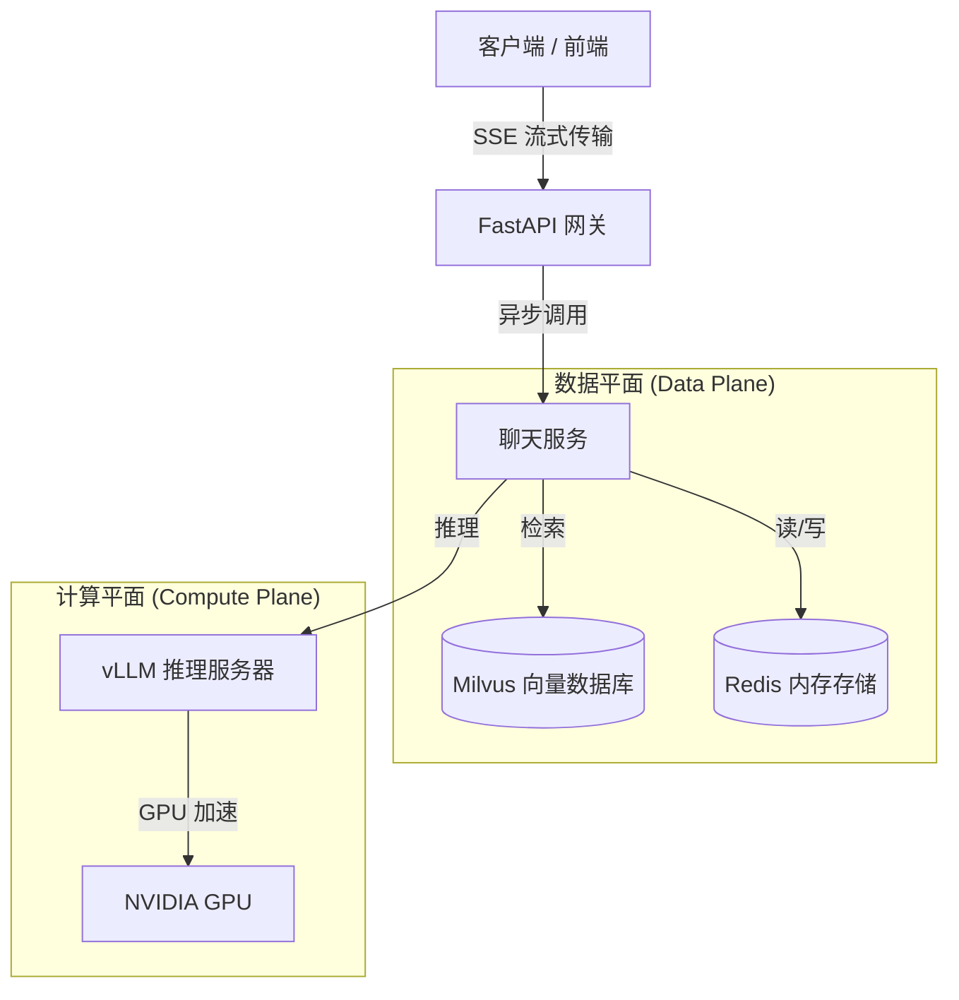

# 企业级 AI 大脑 (RAG 基础设施)

[ [English](./README.md) ] | [ **中文** ]

> 一个生产级的 AI 知识库后端，具有 **双层 RAG**、**异步推理** 和 **持久化记忆** 功能。专为高并发和高标准工程化设计。

  

</div>

## 🏗 系统架构

本项目实现了一个可扩展的 **检索增强生成 (RAG)** 管道，旨在解决企业级应用常见的挑战：数据幻觉、上下文窗口限制和无状态交互。



## 🚀 核心特性

* **高性能推理:** 采用 **vLLM** (PagedAttention) 作为解耦的推理引擎，相比朴素 Transformer 架构吞吐量提升 10 倍。
* **企业级 RAG:**
* **Milvus:** 支持十亿级规模的向量存储。
* **混合检索:** 支持语义检索 + 关键词检索 (Hybrid Search)。
* **LlamaIndex:** 用于高级分块策略 (Chunking) 的编排与管理。


* **上下文记忆:** 基于 **Redis 的会话管理**，支持 AI 在多轮对话中记忆用户上下文 (采用滑动窗口策略)。
* **流式优先:** 全面支持 **Server-Sent Events (SSE)**，首字生成时间 (TTFT) < 500ms。
* **生产就绪:**
* **Requirements.txt:** 严格的依赖管理。
* **Dockerized:** 容器化部署，确保环境一致性。
* **清洁架构:** 采用 Controller-Service-Repository 分层设计模式。


## 🛠 技术栈

* **Web 框架:** FastAPI, Uvicorn
* **编排框架:** LlamaIndex (Advanced RAG)
* **向量数据库:** Milvus (开发环境可用 Milvus Lite)
* **推理引擎:** vLLM (OpenAI 兼容 API)
* **Embedding 模型:** BAAI/bge-m3 (SOTA 中英文嵌入模型)
* **记忆存储:** Redis
* **容器化:** Docker, Docker Compose

## ⚡️ 快速开始

### 环境要求

* Docker & Docker Compose
* Python 3.10+ (如果需要在本地运行)
* 可用的 GPU 服务器 (用于 vLLM) 或 OpenAI API Key

### 1. 环境配置

```bash
# 克隆仓库
git clone [https://github.com/your-username/enterprise-ai-backend.git](https://github.com/your-username/enterprise-ai-backend.git)
cd enterprise-ai-backend

# 安装依赖 (如果本地运行)
pip install -r requirements.txt

# 开发环境下，安装开发依赖
pip install -r requirements-dev.txt

# 配置环境变量
cp .env.example .env
# 编辑 .env 文件，配置您的 vLLM/Milvus/Redis 地址

```

### 2. 使用 Docker Compose 启动

```bash
docker-compose up -d --build

```

API 服务将在 `http://localhost:8080` 启动。
Swagger UI 文档地址: `http://localhost:8080/docs`

### 3. 调用示例

**文档入库 (Ingest):**

```bash
curl -X POST "http://localhost:8080/api/v1/ingest/upload" \
     -H "accept: application/json" \
     -H "Content-Type: multipart/form-data" \
     -F "file=@./technical_spec.pdf"

```

**流式对话 (Chat with SSE):**

```bash
curl -N -X POST "http://localhost:8080/api/v1/chat/completions" \
     -H "Content-Type: application/json" \
     -d '{
            "query": "这个系统的架构是怎样的？",
            "session_id": "user_123",
            "stream": true
          }'

```

## 📂 项目结构

```text
├── app
│   ├── api          # API 控制器 (FastAPI Routers)
│   │   └── v1       # API v1 端点 (chat, ingest, admin, llm, vector-store, memory)
│   ├── core         # 全局配置与安全
│   │   ├── config.py           # 配置管理
│   │   ├── config_validator.py # 配置验证
│   │   ├── security.py         # API 密钥验证
│   │   ├── exceptions.py       # 异常处理
│   │   ├── logging.py          # 日志设置
│   │   ├── middleware.py       # 请求中间件
│   │   ├── retry.py            # 重试机制
│   │   ├── connections.py      # 连接池
│   │   └── cache.py            # 缓存层
│   ├── models       # Pydantic 数据模型 (Schemas)
│   ├── services     # 业务逻辑层
│   │   ├── chat_service.py     # RAG 聊天服务
│   │   ├── ingest_service.py   # 文档入库服务
│   │   └── memory_service.py   # 记忆管理服务
│   └── utils        # 工厂模式与工具类
│       ├── llm_factory.py            # LLM 初始化工厂
│       ├── llm_providers.py          # 多 LLM 支持
│       ├── vector_store_providers.py # 多向量库支持
│       ├── memory_providers.py       # 多记忆方案支持
│       ├── chunking.py               # 文档分块工具
│       └── vector_store.py           # 向量库管理器
├── tests            # Pytest 测试套件
├── Dockerfile       # 多阶段构建文件
├── docker-compose.yml # Docker 编排文件
├── requirements.txt # 生产环境依赖
├── requirements-dev.txt # 开发环境依赖
├── .env.example     # 环境变量模板
└── README.md        # 项目文档

```

## 📚 详细文档

* [OPTIMIZATION_SUMMARY.md](https://www.google.com/search?q=OPTIMIZATION_SUMMARY.md) - 优化总结
* [MULTI_LLM_SUPPORT.md](https://www.google.com/search?q=MULTI_LLM_SUPPORT.md) - 多 LLM 支持文档
* [MULTI_VECTOR_STORE_SUPPORT.md](https://www.google.com/search?q=MULTI_VECTOR_STORE_SUPPORT.md) - 多向量数据库支持文档
* [MULTI_MEMORY_SUPPORT.md](https://www.google.com/search?q=MULTI_MEMORY_SUPPORT.md) - 多记忆方案支持文档
* [PROJECT_REVIEW.md](https://www.google.com/search?q=PROJECT_REVIEW.md) - 项目审查报告
* [DEPLOYMENT_GUIDE.md](https://www.google.com/search?q=DEPLOYMENT_GUIDE.md) - 部署指南
* [TROUBLESHOOTING.md](https://www.google.com/search?q=TROUBLESHOOTING.md) - 故障排查指南
* [tests/README.md](https://www.google.com/search?q=tests/README.md) - 测试文档

```

---

*Built with ❤️ by zhongshoujin. Open for AI Backend opportunities.*

```